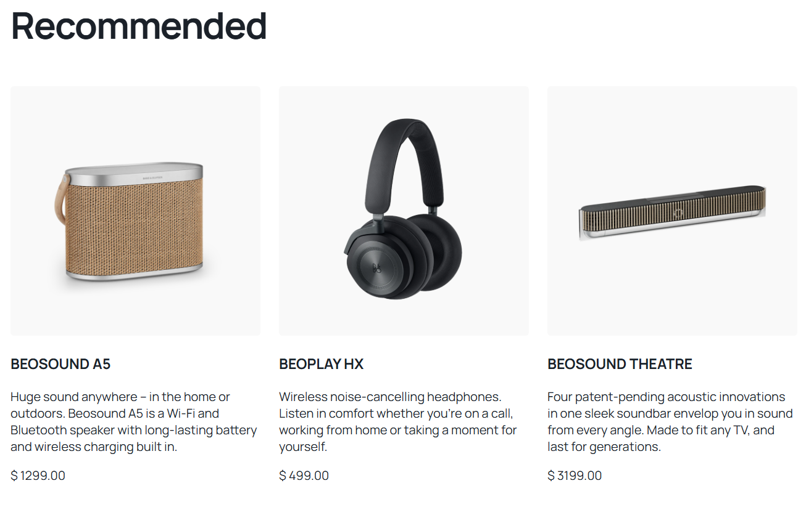
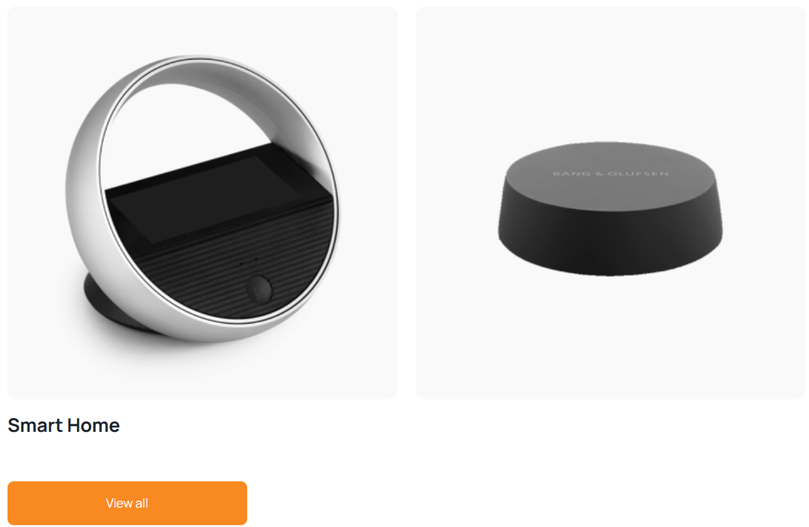
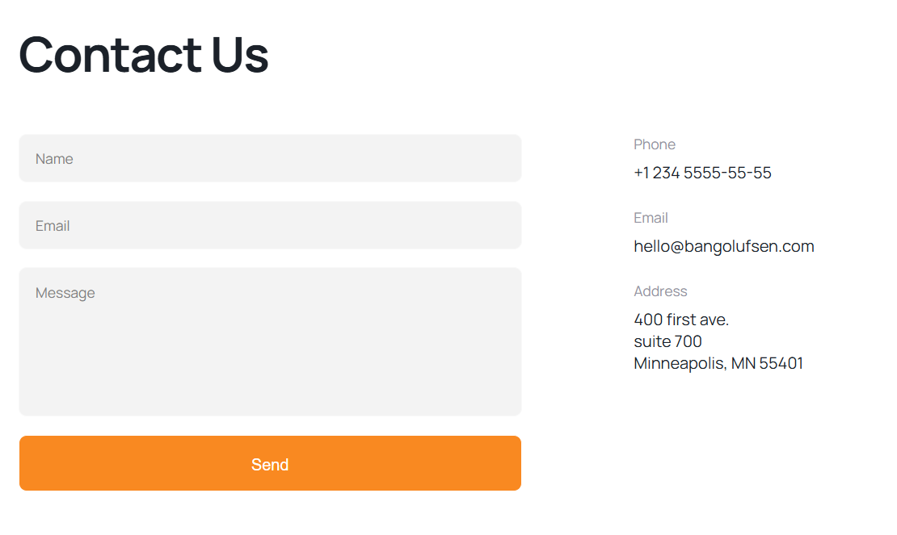

# Modern Landing Page

A fully responsive landing page built using **HTML**, **SCSS**, and **vanilla JavaScript**.  
The project implements a structured SCSS architecture, reusable components, and a clean visual layout inspired by modern marketing websites.

---

## 🎯 Project Overview

This landing page was created as part of my front-end development practice to simulate building a real website from a design.  
While the idea is based on a course assignment, the implementation, structure, improvements, and code decisions are made by me.

The project focuses on:
- Writing clean and maintainable SCSS  
- Organizing styling into modules (blocks, utils)  
- Following the **BEM methodology**  
- Implementing responsive layouts for mobile & desktop  
- Adding light interactivity using vanilla JavaScript  

---

## 🚀 Features & Functionality

### 🌐 Full Responsive Layout
- Mobile-first approach  
- Flexible grid and flexbox layouts  
- Adaptive typography and spacing  
- Optimized for different screen sizes  

### 🎨 Modular SCSS Architecture
The styling is split into dedicated components:

- `blocks/` folder for individual sections (header, menu, categories, products, forms, footer, etc.)
- `utils/` folder for:
  - Global variables (colors, fonts, spacing)
  - Mixins (media queries, reusable flex/grid helpers)
- `main.scss` as the main entry file imported into the compiled `main.css`

This structure improves scalability and readability.

### 🧩 Multiple Page Sections
The landing page includes:

- **Top navigation bar** with logo & menu  
- **Hero section** with main call-to-action  
- **Categories section**  
- **Recommended and Timeless product sections**  
- **Informational blocks** describing features  
- **Contact form** section  
- **Footer** with icons & links  

Each section has its own SCSS file inside `styles/blocks`, making the style system component-based.

### ⚙️ JavaScript Interactions
A small `main.js` file handles simple UI behavior, such as:

- Mobile menu toggle  
- Smooth interface feedback  

The project intentionally keeps JS light, focusing more on layout and styling.

---

## 🛠 Tech Stack

- **HTML5** for structure  
- **SCSS** for styling with nesting, variables, mixins  
- **CSS (compiled)** from SCSS  
- **JavaScript (Vanilla)** for interactions  
- **BEM methodology** for cleaner class naming  

---

## 📸 Screenshots





---

## 🌐 Live Demo
https://landing-page-arber.vercel.app/

---

## 📁 Folder Structure

```text
landing-page-portfolio/
  index.html
  src/
    favicon/             # Icons
    images/              # Website images
    screenshots/         # Website Screenshots
    scripts/
      main.js            # JS interactions
    styles/
      blocks/            # Component-level SCSS files (header, menu, forms, etc.)
      utils/             # Variables, mixins
      main.scss          # SCSS entry point
      main.css           # Compiled CSS (auto-generated)
